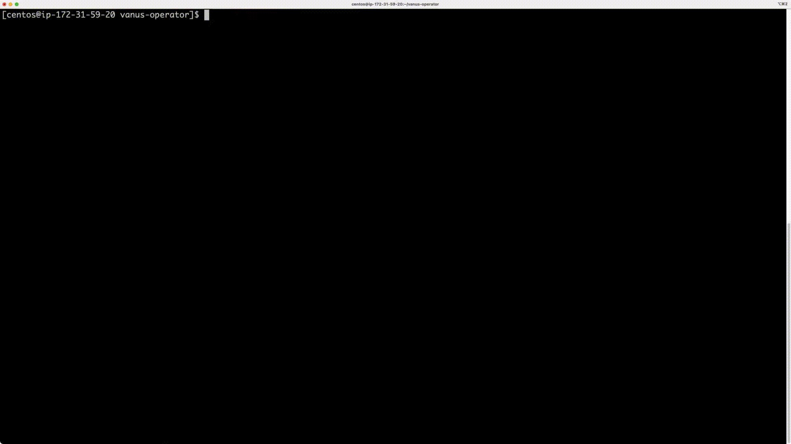

# Vanus Operator
[](https://github.com/vanus-labs/vanus/blob/main/LICENSE)
[](https://golang.org/)

## Table of Contents
- [Overview](#overview)
- [Quick Start](#quick-start)
  - [Deploy Vanus Operator](#deploy-vanus-operator)
  - [Define Your Vanus Cluster](#define-your-vanus-cluster)
  - [Create Vanus Cluster](#create-vanus-cluster)
  - [Delete Vanus Cluster](#delete-vanus-cluster)
  - [UnDeploy Vanus Operator](#undeploy-vanus-operator)

## Overview

Vanus Operator is to manage Vanus service instances deployed on the Kubernetes cluster.
It is built using the [Operator SDK](https://github.com/operator-framework/operator-sdk), which is part of the [Operator Framework](https://github.com/operator-framework/).

## Quick Start

<p align="center">
  
</p>

### Deploy Vanus Operator

1. Clone the project on your Kubernetes cluster master node:
```
$ git clone https://github.com/vanus-labs/vanus-operator.git
$ cd vanus-operator
```

2. To deploy the Vanus Operator on your Kubernetes cluster, please run the following command:

```shell
$ make deploy
```

**NOTE:** Default deployment is under the `default` namespace. You can also specify the namespace for deployment by the `VANUS_NAMESPACE` parameter, use command like:

```shell
$ make VANUS_NAMESPACE=vanus deploy
```

3. Use command ```kubectl get pods``` to check the Vanus Operator deploy status like:

```
$ kubectl get pods
NAME                            READY   STATUS    RESTARTS   AGE
vanus-operator-c6dd5f54-zss8t   1/1     Running   0          9s
```

If you find that pod image is not found, run the following command to build a new one locally,
the image tag is specified by the `IMG` parameter.

```shell
$ make docker-build IMG=vanus-operator:latest
```

Now you can use the CRDs provided by Vanus Operator to deploy your Vanus cluster.

### Define Your Vanus Cluster

Vanus Operator provides several CRDs to allow users define their Vanus service component cluster, which includes the Controller, Store, Trigger, Timer, Gateway, etc.

1. Check the file ```vanus_v1alpha1_cluster.yaml``` in the ```example``` directory which we put these CR together:
```
# Licensed to the Apache Software Foundation (ASF) under one or more
# contributor license agreements.  See the NOTICE file distributed with
# this work for additional information regarding copyright ownership.
# The ASF licenses this file to You under the Apache License, Version 2.0
# (the "License"); you may not use this file except in compliance with
# the License.  You may obtain a copy of the License at
#
#     http://www.apache.org/licenses/LICENSE-2.0
#
# Unless required by applicable law or agreed to in writing, software
# distributed under the License is distributed on an "AS IS" BASIS,
# WITHOUT WARRANTIES OR CONDITIONS OF ANY KIND, either express or implied.
# See the License for the specific language governing permissions and
# limitations under the License.

apiVersion: v1
data:
  controller.yaml: |-
    node_id: ${NODE_ID}
    name: ${POD_NAME}
    ip: ${POD_IP}
    port: 2048
    etcd:
      - vanus-controller-0.vanus-controller:2379
      - vanus-controller-1.vanus-controller:2379
      - vanus-controller-2.vanus-controller:2379
    data_dir: /data
    replicas: 3
    metadata:
      key_prefix: /vanus
    topology:
      vanus-controller-0: vanus-controller-0.vanus-controller.default.svc:2048
      vanus-controller-1: vanus-controller-1.vanus-controller.default.svc:2048
      vanus-controller-2: vanus-controller-2.vanus-controller.default.svc:2048
    embed_etcd:
      # relative path to ${data_dir} above
      data_dir: etcd/data
      listen_client_addr: 0.0.0.0:2379
      listen_peer_addr: 0.0.0.0:2380
      advertise_client_addr: ${POD_NAME}.vanus-controller:2379
      advertise_peer_addr: ${POD_NAME}.vanus-controller:2380
      clusters:
        - vanus-controller-0=http://vanus-controller-0.vanus-controller:2380
        - vanus-controller-1=http://vanus-controller-1.vanus-controller:2380
        - vanus-controller-2=http://vanus-controller-2.vanus-controller:2380
kind: ConfigMap
metadata:
  name: config-controller
  namespace: default

---
apiVersion: v1
data:
  store.yaml: |-
    port: 11811
    ip: ${POD_IP}
    controllers:
      - vanus-controller-0.vanus-controller:2048
      - vanus-controller-1.vanus-controller:2048
      - vanus-controller-2.vanus-controller:2048
    volume:
      id: ${VOLUME_ID}
      dir: /data
      capacity: 1073741824
    meta_store:
      wal:
        io:
          engine: psync
    offset_store:
      wal:
        io:
          engine: psync
    raft:
      wal:
        io:
          engine: psync
kind: ConfigMap
metadata:
  name: config-store
  namespace: default

---
apiVersion: v1
data:
  trigger.yaml: |-
    port: 2148
    ip : ${POD_IP}
    controllers:
      - vanus-controller-0.vanus-controller.default.svc:2048
      - vanus-controller-1.vanus-controller.default.svc:2048
      - vanus-controller-2.vanus-controller.default.svc:2048
kind: ConfigMap
metadata:
  name: config-trigger
  namespace: default

---
apiVersion: v1
data:
  timer.yaml: |-
    name: "timer"
    ip: ${POD_IP}
    etcd:
      - vanus-controller-0.vanus-controller:2379
      - vanus-controller-1.vanus-controller:2379
      - vanus-controller-2.vanus-controller:2379
    metadata:
      key_prefix: "/vanus"
    leaderelection:
      lease_duration: 15
    timingwheel:
      tick: 1
      wheel_size: 32
      layers: 4
    controllers:
      - vanus-controller-0.vanus-controller.default.svc:2048
      - vanus-controller-1.vanus-controller.default.svc:2048
      - vanus-controller-2.vanus-controller.default.svc:2048
kind: ConfigMap
metadata:
  name: config-timer
  namespace: default

---
apiVersion: v1
data:
  gateway.yaml: |-
    port: 8080
    controllers:
      - vanus-controller-0.vanus-controller:2048
      - vanus-controller-1.vanus-controller:2048
      - vanus-controller-2.vanus-controller:2048
kind: ConfigMap
metadata:
  name: config-gateway
  namespace: default

---
apiVersion: v1
kind: Service
metadata:
  name: vanus-gateway
  namespace: default
spec:
  ports:
  - name: put
    nodePort: 30001
    port: 8080
    targetPort: 8080
  - name: get
    nodePort: 30002
    port: 8081
    targetPort: 8081
  - name: ctrl-proxy
    nodePort: 30003
    port: 8082
    targetPort: 8082
  selector:
    app: vanus-gateway
  type: NodePort

---
apiVersion: vanus.vanus.ai/v1alpha1
kind: Controller
metadata:
  name: vanus-controller
  namespace: default
spec:
  # replicas is the number of controllers.
  replicas: 3
  # controllerImage is the customized docker image repo of the RocketMQ Controller
  image: public.ecr.aws/vanus/controller:v0.4.0
  # imagePullPolicy is the image pull policy
  imagePullPolicy: IfNotPresent
  volumeClaimTemplates:
  - metadata:
      name: data
    spec:
      accessModes:
      - ReadWriteOnce
      resources:
        requests:
          storage: 1Gi

---
apiVersion: vanus.vanus.ai/v1alpha1
kind: Store
metadata:
  name: vanus-store
  namespace: default
spec:
  # replicas is the number of stores.
  replicas: 3
  # storeImage is the customized docker image repo of the RocketMQ Controller
  image: public.ecr.aws/vanus/store:v0.4.0
  # imagePullPolicy is the image pull policy
  imagePullPolicy: IfNotPresent
  volumeClaimTemplates:
  - metadata:
      name: data
    spec:
      accessModes:
      - ReadWriteOnce
      resources:
        requests:
          storage: 1Gi

---
apiVersion: vanus.vanus.ai/v1alpha1
kind: Trigger
metadata:
  name: vanus-trigger
  namespace: default
spec:
  # triggerImage is the customized docker image repo of the RocketMQ Controller
  image: public.ecr.aws/vanus/trigger:v0.4.0
  # imagePullPolicy is the image pull policy
  imagePullPolicy: IfNotPresent

---
apiVersion: vanus.vanus.ai/v1alpha1
kind: Timer
metadata:
  name: vanus-timer
  namespace: default
spec:
  # timerImage is the customized docker image repo of the RocketMQ Controller
  image: public.ecr.aws/vanus/timer:v0.4.0
  # imagePullPolicy is the image pull policy
  imagePullPolicy: IfNotPresent

---
apiVersion: vanus.vanus.ai/v1alpha1
kind: Gateway
metadata:
  name: vanus-gateway
  namespace: default
spec:
  # gatewayImage is the customized docker image repo of the Vanus Controller
  image: public.ecr.aws/vanus/gateway:v0.4.0
  # imagePullPolicy is the image pull policy
  imagePullPolicy: IfNotPresent
```

The yaml defines the Vanus cluster minimization configuration. By default, Controller and Store is three replicas to ensure leader election.

> Notice: Currently, you still need to customize the components configmap and Gateway service. We plan that these resources will be created uniformly by the operator in the future. You can focus more on the business logic.

### Create Vanus Cluster

1. Deploy the Vanus cluster by running:

``` 
$ make cluster
configmap/config-controller created
configmap/config-gateway created
configmap/config-store created
configmap/config-timer created
configmap/config-trigger created
service/vanus-gateway created
controller.vanus.vanus.ai/vanus-controller created
gateway.vanus.vanus.ai/vanus-gateway created
store.vanus.vanus.ai/vanus-store created
timer.vanus.vanus.ai/vanus-timer created
trigger.vanus.vanus.ai/vanus-trigger created
```

**NOTE:** Default creation is under the `default` namespace. You can also specify the namespace for creation by the `VANUS_NAMESPACE` parameter, use command like:

```shell
$ make VANUS_NAMESPACE=vanus cluster
```

Check the status:

```
$ kubectl get pods -owide
NAME                            READY   STATUS    RESTARTS   AGE     IP            NODE       NOMINATED NODE   READINESS GATES
vanus-controller-0              1/1     Running   0          24s     172.17.0.9    minikube   <none>           <none>
vanus-controller-1              1/1     Running   0          18s     172.17.0.11   minikube   <none>           <none>
vanus-controller-2              1/1     Running   0          14s     172.17.0.13   minikube   <none>           <none>
vanus-gateway-95ccb5d95-5c6kc   1/1     Running   0          24s     172.17.0.7    minikube   <none>           <none>
vanus-operator-c6dd5f54-zss8t   1/1     Running   0          2m30s   172.17.0.3    minikube   <none>           <none>
vanus-store-0                   1/1     Running   0          24s     172.17.0.8    minikube   <none>           <none>
vanus-store-1                   1/1     Running   0          18s     172.17.0.10   minikube   <none>           <none>
vanus-store-2                   1/1     Running   0          15s     172.17.0.12   minikube   <none>           <none>
vanus-timer-684646fbcd-87s69    1/1     Running   0          24s     172.17.0.5    minikube   <none>           <none>
vanus-timer-684646fbcd-ck8qr    1/1     Running   0          24s     172.17.0.4    minikube   <none>           <none>
vanus-trigger-98b9c5846-7qcmq   1/1     Running   0          24s     172.17.0.6    minikube   <none>           <none>
```

Using the default yaml, we can see that there are 3 controller Pods and 3 store Pods running on the k8s cluster. In addition, there are 1 trigger Pod, 2 timer Pods and 1 gateway Pod.

2. Install `vsctl` and visit the Vanus cluster

**NOTE:** `vsctl` is a command line tool for Vanus

**Firstly**, download **vsctl**, the command line tool of Vanus.

```shell
curl -O https://download.linkall.com/vsctl/v0.4.0/linux-amd64/vsctl
chmod ug+x vsctl
sudo mv vsctl /usr/local/bin
```

**Secondly**, use `vsctl version` to check the installation

```shell
+-----------+---------------------------------+
|  Version  | v0.4.0                          |
|  Platform | linux/amd64                     |
| GitCommit | 0e2d371                         |
| BuildDate | 2022-11-01_03:47:49+0000        |
| GoVersion | go version go1.18.7 linux/amd64 |
+-----------+---------------------------------+
```

**Then**, set Vanus endpoint

use `minikube service list -n ${VANUS_NAMESPACE}` to get **Vanus Gateway**'s endpoint

```shell
|-----------|------------------|-----------------|---------------------------|
| NAMESPACE |       NAME       |   TARGET PORT   |            URL            |
|-----------|------------------|-----------------|---------------------------|
| vanus     | vanus-controller | No node port    |
| vanus     | vanus-gateway    | put/8080        | http://192.168.49.2:30001 |
|           |                  | get/8081        | http://192.168.49.2:30002 |
|           |                  | ctrl-proxy/8082 | http://192.168.49.2:30003 |
|-----------|------------------|-----------------|---------------------------|
```

**NOTE:** if you are using a normal k8s cluster, just use `kubectl get svc -n ${VANUS_NAMESPACE}` to find the endpoint

use evn variable to tell the endpoint to vsctl

```shell
export VANUS_GATEWAY=192.168.49.2:30001
```

**Finally**, validating if it has connected to Vanus

```shell
vsctl cluster controller topology
```

output should look like

```shell
+-------------------+--------+----------------------------------------------------+
|        NAME       | LEADER |                      ENDPOINT                      |
+-------------------+--------+----------------------------------------------------+
| Leader-controller |  TRUE  | vanus-controller-1.vanus-controller.vanus.svc:2048 |
+-------------------+--------+----------------------------------------------------+
|      Gateway      |    -   |                                                    |
+-------------------+--------+----------------------------------------------------+
```

More information can be found via the [Quick Start](https://docs.linkall.com/getting-started/quick-start)

Congratulations! You have successfully deployed your Vanus cluster by Vanus Operator.

### Delete Vanus Cluster
To delete Vanus cluster:
``` 
$ make uncluster
configmap "config-controller" deleted
configmap "config-gateway" deleted
configmap "config-store" deleted
configmap "config-timer" deleted
configmap "config-trigger" deleted
service "vanus-gateway" deleted
controller.vanus.vanus.ai "vanus-controller" deleted
gateway.vanus.vanus.ai "vanus-gateway" deleted
store.vanus.vanus.ai "vanus-store" deleted
timer.vanus.vanus.ai "vanus-timer" deleted
trigger.vanus.vanus.ai "vanus-trigger" deleted
```

**NOTE:** You can also specify the namespace for deletion by the `VANUS_NAMESPACE` parameter, use command like:

```shell
$ make VANUS_NAMESPACE=vanus uncluster
```

### UnDeploy Vanus Operator

```sh
make undeploy
customresourcedefinition.apiextensions.k8s.io "controllers.vanus.vanus.ai" deleted
customresourcedefinition.apiextensions.k8s.io "gateways.vanus.vanus.ai" deleted
customresourcedefinition.apiextensions.k8s.io "stores.vanus.vanus.ai" deleted
customresourcedefinition.apiextensions.k8s.io "timers.vanus.vanus.ai" deleted
customresourcedefinition.apiextensions.k8s.io "triggers.vanus.vanus.ai" deleted
serviceaccount "vanus-operator" deleted
clusterrole.rbac.authorization.k8s.io "vanus-operator" deleted
clusterrolebinding.rbac.authorization.k8s.io "vanus-operator" deleted
deployment.apps "vanus-operator" deleted
```

**NOTE:** You can also specify the namespace for undeployment by the `VANUS_NAMESPACE` parameter, use command like:

```shell
$ make VANUS_NAMESPACE=vanus undeploy
```

## Contributing
// TODO(user): Add detailed information on how you would like others to contribute to this project

### How it works
This project aims to follow the Kubernetes [Operator pattern](https://kubernetes.io/docs/concepts/extend-kubernetes/operator/)

It uses [Controllers](https://kubernetes.io/docs/concepts/architecture/controller/) 
which provides a reconcile function responsible for synchronizing resources untile the desired state is reached on the cluster 

## License

Copyright 2023 Linkall Inc.

Licensed under the Apache License, Version 2.0 (the "License");
you may not use this file except in compliance with the License.
You may obtain a copy of the License at

    http://www.apache.org/licenses/LICENSE-2.0

Unless required by applicable law or agreed to in writing, software
distributed under the License is distributed on an "AS IS" BASIS,
WITHOUT WARRANTIES OR CONDITIONS OF ANY KIND, either express or implied.
See the License for the specific language governing permissions and
limitations under the License.

